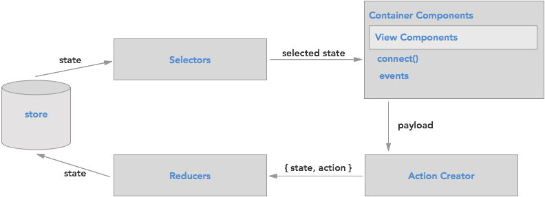
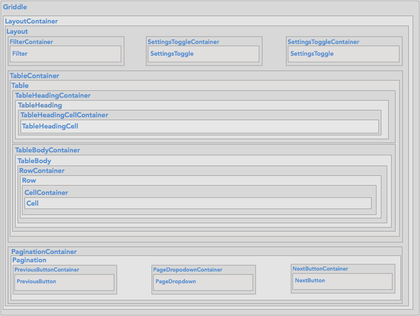
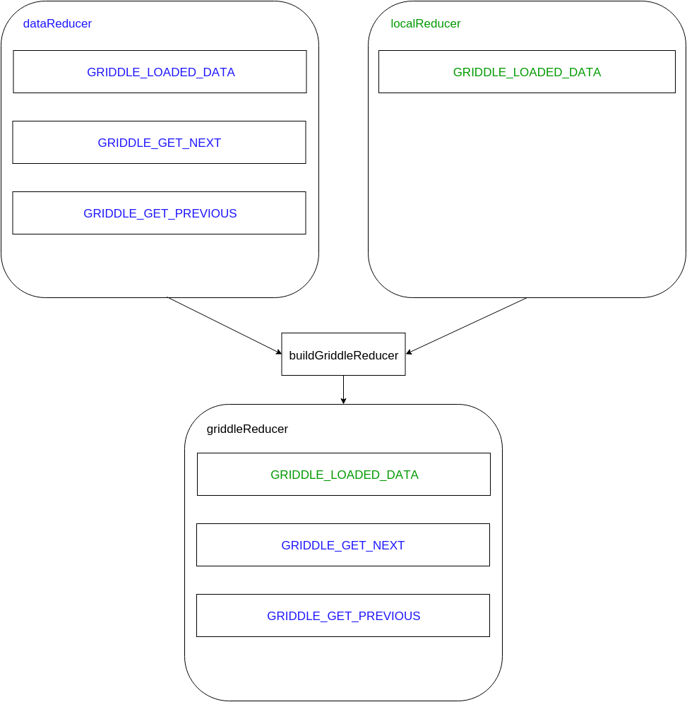

Griddle exists as a component that is structured similar to many React applications. While Griddle uses Redux, it's
self-contained and does not dictate the structure of the containing application. The following diagram represents the
high-level Griddle architecture.

### Components ###

Griddle is arranged into a series of container and view components. Container components connect to the store, setup logic, and wire up actions to
the view components as props. No logic should live in the view components -- these components should be pure components made up
entirely of their props. For more discussion on this mindset [read this post by Dan Abramov](https://medium.com/@dan_abramov/smart-and-dumb-components-7ca2f9a7c7d0#.ebou9i9rf).

The components are deeply nested but only a minimal amount of props are passed from the top down. Most of the data is obtained through
the container components connection to the Redux store and passed to the view components as props.

### reducers ###
Reducers in Griddle are methods that work against an immutable state object. A standard reducer method should look like:

``
export const SOME_CONSTANT_NAME(state, action, helpers) {
  return state;
}
``

Where `state` is the immutable state object, `action` is the action object created by an action creator, and `helpers` is an object consisting of the combined helper
methods.

##### Reducer data flow ####

When Griddle is initialized, it takes an array of reducers to combine/compose into one reducer. Reducer methods will
 override other reducer methods with the same name depending on the reducer's location in the array. The following diagram represents what would happen if
we had two reducers called dataReducer and localReducer that were passed in to griddleReducer like `['data-reducer', 'local-reducer']`.

Since the methods have the same name,`GRIDDLE_LOADED_DATA` from local-reducer will be the method that gets used when the action with that name is dispatched.

##### pre/post hooks ####

Often it is not ideal to override a method in the context of a plugin and instead the desired outcome would be to wrap or compose an original reducer method as a
series of reducer methods. To that end, Griddle uses a concept of pre/post hooks.

**AFTER method**

Append "\_AFTER" to any reducer method name to perform an additional reduce operation on the state object

For example, say we define our reducer plugin array as
`[data-reducer, local-reducer, subgrid-reducer, selection-reducer]`. If subgrid-reducer and selection-reducer both have a method GRIDDLE_LOADED_DATA_AFTER,
the operation flow for GRIDDLE_LOADED_DATA will look a little like the following:

1. The `GRIDDLE_LOADED_DATA` method will reduce the state object
1. `GRIDDLE_LOADED_DATA_AFTER` in subgrid-reducer will return a new (immutable) state object based on the state object it received
1. `GRIDDLE_LOADED_DATA_AFTER` in selection-reducer will return a new state object which will be the resultant state object for the dispatch

**BEFORE method**

Append \_BEFORE to any reducer method name to modify the state object passed to the default reducer method. Like \_AFTER, these methods are composed if there are
other plugins that contain the same method name.

**AFTER_REDUCE**

If there is an operation that should run directly before returning the final state object for **any** reducer method, it should occur in a AFTER_REDUCE method.
AFTER_REDUCE methods are composed similarly to the BEFORE / AFTER methods above.

**BEFORE_REDUCE**

If there is an operation that should run before **any** reducer method, it should occur in a BEFORE_REDUCE method.
BEFORE_REDUCE methods are composed similarly to the BEFORE / AFTER methods above.

## Selectors ##

Griddle uses [reselect](https://github.com/reactjs/reselect) and selectors to obtain parts of data from the store state. Selectors
allow for some performance benefit but also make the code a little easier to follow. The container components will use
individual selectors to obtain the data that they need.

## Pluggable Architecture ##

This architecture allows overriding any part of this system while keeping everything else intact. For example, a plugin could
have a series of its own container components and selectors and the view components and reducers would work with out any modification.
In fact, this is exactly what we are doing with Griddle for the local data plugin (the plugin that says you want to maintain all your
data locally in the browser). [See more about this in the plugins section](/plugins)
